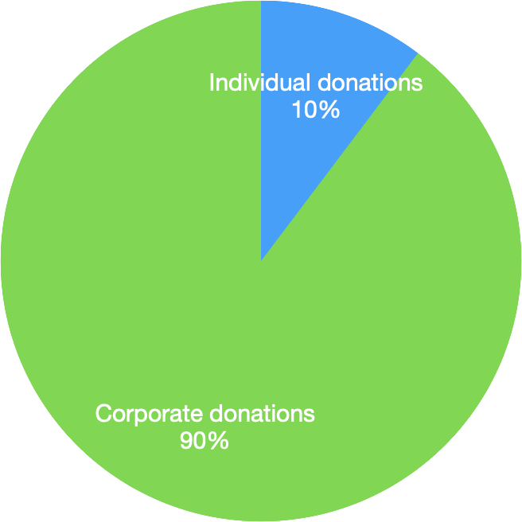
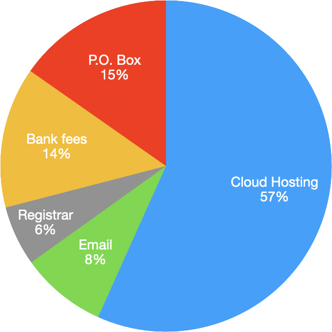

This report summarizes the activity of the Five Borough Fedi Project (5BFP) during calendar year 2024, including a high-level accounting of the organization’s financial income and expenditures. As a public-service organization that many people entrust with their time, attention, and money, 5BFP presents this report in an effort to show how it has applied its community’s investments over the past calendar year.

5BFP president Jason McIntosh wrote and published this report in February 2025, based on 5BFP’s internal financial records. All monetary amounts that appear in this report are expressed in U.S. dollars.

## Summary

5BFP incorporated with New York State on February 23, 2024, under the full legal name "Five Borough Fedi Project, Inc." We received 501(c)(3) charitable nonprofit recognition from the IRS on April 22.

During calendar year 2024, 5BFP spent a bit less than $1,500, mostly on paying for the various hosting services that power Masto.NYC. We started to use and pay for these services only in August 2024, and the relatively modest expenditure reflects this late start.

5BFP operations have largely been covered by a generous corporate matching program, associated with a small number of donors. This has given the organization the good fortune of a relatively worry-free launch, though we do need to follow up to reduce its financial dependence on a single income source.

## Program activity

In 2024, the only program of 5BFP was the care and maintenance of the Masto.NYC Mastodon server. Long-term stewardship of Masto.NYC was the founders' primary reason for incorporating 5BFP. As of the end of the year, Masto.NYC remains the organization's sole focus and priority.

Masto.NYC was originally launched as a passion project in late 2022, well before the incorporation (or even the ideation) of 5BFP. The Masto.NYC service continued uninterrupted through the formation of 5BFP and the subsequent migration of Masto.NYC infrastructure from physical servers in an East Village apartment to virtual servers in a Digital Ocean datacenter, located elsewhere in New York City.

## Financial summary

We took in $4,174.68 and spent $1,453.39, for a net gain of $2,721.29. Since 2024 was the year that the organization, $2,721.29 also reflects the amount of money that 5BFP had in its bank account at year's end.

### Income

5BFP took in $4,174.68 during 2024:

* $3,745.00 came from a corporate charity program, with employees of that corporation using their philanthropy employment benefit to direct donations to 5BFP.
* $429.68 came from individual donors.

The lopsided nature of these two funding sources has two causes:

* We didn't start to actively solicit donations from Masto.NYC users until August 2024, coinciding with the migration of the Masto.NYC infrastructure into a cloud-based environment.
* 5BFP is a nonprofit whose origins partially lay in the private technology sector, giving its founders ready access to corporate philanthropic programs.

### Expenditures

5BFP spent $1,453.39 during 2024:

* $1,031.39 paid for hosting and other digital infrastructure:
    * $490.44 to Digital Ocean, the primary host of Masto.NYC services.
    * $333.95 to Cloudflare, which Masto.NYC uses for network resiliency.
    * $122.00 to FastMail, which handles email services for Masto.NYC and 5BFP.
    * $85.00 to Namecheap, the domain registrar used by Masto.NYC and 5BFP.
* $222.00 leased a physical post office box.
* $200.00 covered various bank fees. These included some overdraft errors while setting up the organization, which 5BFP board members covered by making personal donations to 5BFP.

The Digital Ocean expense reflects less than half a year of service, since Masto.NYC migrated to a cloud-based system only in August 2024. 

## Looking ahead

We project that 5BFP will need to spend more than $3,000 on its infrastructure during 2025, a figure that includes a full year of service from Digital Ocean at our current monthly rate.

Thanks to regular monthly income from a corporate matching program, 5BFP will likely cover this cost without difficulty in 2025. However, we need to acknowledge that this income source is as fragile as it is generous: it depends upon the continued employment of a very small number of donors within that corporation, as well as no change in philanthropic priorities for those employees.

Since we don't wish to assume that either of these will remain true indefinitely into the future, 5BFP intends to ramp up the following two efforts in 2025:

* Grow the community of active Masto.NYC users. We want to achieve a new baseline of 200 monthly active users (MAU), up from our 2024 average of 150-ish MAU.
* Put more energy and visibility into fundraising. We'd like to make our user base feel good about helping to financially support Masto.NYC, letting 5BFP become less dependent on its initial corporate-matching source.
